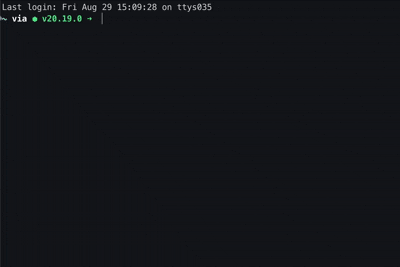

# tmdr

## too medical; didn't read

A fast, offline CLI tool and Terminal app for looking up medical acronyms. Built for engineers in healthtech.

**tmdr** gives you instant, offline access to medical acronyms. no context switching, no token burn.

<p align="center">
  
</p>

## Features

⚡ **Instant CLI lookup** - inline medical acronyms</br>
🎨 **Terminal User Interface** - using charm bubbles ui and lipgloss</br>
🔍 **Real-time search** - Type to filter results instantly</br>
🎯 **Fuzzy matching** - Handles typos gracefully</br>
📚 **Zero dependencies** - Works completely offline</br>
🚀 **Cross-platform** - Mac, Linux, Windows ready

You can read more about tmdr at the [website](https://tmdr.sh)

## Installation

### Option 1: Use curl

```bash
curl -sSL https://tmdr.sh/install | bash
```

### Option 2: Download Pre-built Binary

Download the latest release for your platform from [GitHub Releases](https://github.com/anthony-langham/tmdr/releases):

### Option 3: Install from Source

Requires Go 1.21 or later:

```bash
git clone https://github.com/anthony-langham/tmdr.git
cd tmdr
make install  # Installs to $GOPATH/bin
```

## Usage

### Command Line Interface

Type tmdr & `acronym` and get an answer right in the terminal

```bash
$ tmdr abg
ABG → Arterial Blood Gas
A test measuring oxygen and carbon dioxide in arterial blood.
```

### Terminal User Interface

```bash
tmdr  # Launch TUI
```

#### Search Mode

- Type to search in real-time
- Arrow keys to navigate results
- Enter to view full definition
- ESC to clear or exit

#### Browse Mode

- Navigate all acronyms with arrow keys
- See full definitions instantly

## Development Status

Production Ready

- ✅ Interactive Terminal UI styled with BubbleTea
- ✅ Real-time search with fuzzy matching
- ✅ 107 medical acronyms database
- ✅ Cross-platform support
- ✅ Product feedback integration

## Contributing

Contributions welcome!

- Report issues or suggest features
- Submit pull requests

## Feedback

This is a quick experiment to see how clinical context can be made more accessible to people working in the terminal.

If you're building in healthtech, and you’ve felt this friction before I’d appreciate your feedback

Press `f` in the app to send feedback.

email hello@tmdr.sh

## License

MIT License - See [LICENSE](LICENSE) for details.
</br>
</br>

<p align="center"> <b>Made with 🐝 up north</b>  </p>
